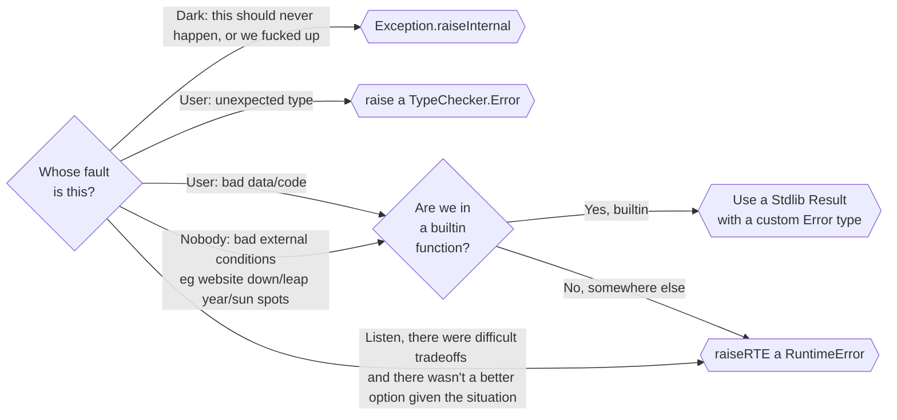

# Error Handling

Within the Darklang F# codebase, there are a number of different ways to handle errors. This document explains which error handling mechanism to use.

Note, this is not for user code or packages, just for the execution engine and the
rest of the darklang runtime (aka stuff written in F#).

## Which error handler to use and when?



## Runtime Errors & Type Errors

The primary way of indicating an error in the runtime and during code execution is a
`RuntimeError`. This indicates there was an exceptional - though anticipated - error in execution, typically caused by the user's code.

Example:

At the end of the `match`, a `RuntimeError` occurs as the Interpreter doesn't know
what to do, due to an error in the user's code.

```fsharp
match 45 with
| 1 -> "only thing matched"
```

Our goal is to fully prevent `RuntimeError`s in our ahead-of-time type checker -- if the code type-checks it should never fail in unexpected ways.

### Using RuntimeError

If you need to raise a RuntimeError, call `RT.Error.raiseRTE`. This throws an
exception with the RuntimeError in it, which is caught at the execution boundary (eg
`LibExecution.Execution.executeExpr`). At the execution boundaries, the execution
functions return F# `Result<Dval, RuntimeError>`s, which are then converted to
`Dval`s so they can be stringified using
`@darklang.languageTools.runtimeErrors.error.toString`.

#### Type errors / TypeChecker

A very common RuntimeError to use is a `TypeChecker.Error.ValueNotExpectedType`,
which indicates that we have the wrong type. Getting the incorrect type is almost
always a problem with user code.

Example: `List.sortBy [1] (fun i -> "not an int")` raises `ValueNotExpectedType("not an int", 1)`

There are helper functions like `TypeChecker.raiseValueNotExpectedType` and
`TypeChecker.raiseFnValResultNotExpectedType` that can make this easier (the latter
for checking return values from first-class functions called from builtin functions).

A `TypeChecker.Error` is a type of `RuntimeError`, so all info about `RuntimeError`s
here applies to it.

#### Tips for using RuntimeErrors

We prefer to raise `RuntimeErrorException`s using `raiseRTE` (or module-specific
variations), instead of returning F# `Result<_, RuntimeError>`.

Never catch a `RuntimeError` anywhere except at the outer boundaries of code
execution in `LibExecution.Execution`. That's not how they're intended to be used,
and will lead to errors being hidden from the user.

#### Source of the Error

`raiseRTE` takes a `DvalSource` (`Option<tlid*id>`), which allows us to indicate to
the user where the error originated.

We're trying to get to a place where we always include a valid `DvalSource` with a
`RuntimeError`, but often it can be hard. We plan to ensure we pass around enough
information so that `RuntimeError`s always have a `DvalSource`.

### Builtin functions

When writing a builtin function, typically we handle errors by returning a
`@darklang.stdlib.Result.Result` value. The `Error` case should use a custom type
appropriate for that function or for general use in the module, defined in a package.

This sort of error handling is appropriate where the user calls the function
incorrectly, or something bad happens beyond our control.

Example: `HttpClient.request "mywebsiteisdowntoday.com" = Error HttpClient.NetworkError`

Example: `Float.parse "not a float" = Error Float.Error.InvalidFloatString`

#### Raise RuntimeErrors for type errors in builtins

If a builtin has a type error, such as the wrong type being returned by
`Interpreter.applyFnVal`, use a `TypeChecker.Error` instead of a `Result`.

If you expect a type, as indicated by the type signature, and it is not that type, a
TypeChecker.Error is appropriate. Use `Result`s for errorable conditions like trying
to read a file which doesn't exist.

#### Custom errors in Builtins

It's important not to use `Result<_, String>` in Builtins, as those errors are
difficult for a user to handle resiliently. Instead, create a darklang type for the
error.

For example `Builtin.HttpClient.request` would return
`@darklang.stdlib.HttpClient.Request`, which is `Result<_, @darklang.stdilib.HttpClient.Error>`.

This is the same best-practice as writing code in a darklang package or user code.

Note that the error type should be created in a package even though it's used from a
builtin - that's by design and works fine.

#### Catch F# exceptions in builtins

If code raises a dotnet `System.Exception`-based Exception, it should be caught at
the callsite and should not spread any further. Do not use the error message
(`e.Message`) from dotnet exceptions in messages to users.

### Exception.raiseInternal

`Exception.raiseInternal` is for things that should not happen. It indicates a bug in
our code, not in the user's code.

Don't use it for things where the user can trigger it by making a coding error - use a
`RuntimeError` for that. This is for things where the user should not have been able
to make this happen.

For example, if we call a builtin function where the parameter type is
`List<String>`, we will still need to go through the list and extract the dotnet
`string`s from the `DString`s in the list. Since the typechecker has already checked
that the list should only have `DString`s in it, finding anything else in there
should be impossible and is a bug in the runtime.

`Exception.raiseInternal` cases are all bugs, and so they are things we wish to know
about.

`Exception.raiseInternal`, in the cloud runtime, creates an exception that we can
track and get alerts for from Rollbar, including a stacktrace and a set of useful
metadata for debugging the issue. We should debug and solve these.

`Exception.raiseInternal`, in the cli runtime, will hopefully be connected to a wizard
to allow users to report internal errors semi-automatically for us to debug and solve.

## RuntimeError implementation

Unusually, a `RuntimeError` contains a `Dval`, which corresponds to a type in
`@darklang.languageTools.runtimeErrors`. Using a `Dval` here allows us define/create
`RuntimeError`s from anywhere, without worrying about F# module ordering.

### Making a new RuntimeError

To make a new `RuntimeError`, look at `@darklang.languageTools.runtimeErrors.Error`.
You can either add a new Enum to it, or more commonly to one of the types within it.
You can also add a new type of `Error` in a submodule of
`@darklang.languageTools.runtimeErrors` and an Enum wrapping it in
`@darklang.languageTools.runtimeErrors.Error`.

Then you will need a set of functions in F# to produce the `Error` as a `Dval`.
You'll also need to stringify the error in
`@darklang.languageTools.runtimeErrors.error.toString`. We commonly also have
convenience functions to raise the exceptions.

A good approach is to have an F# type that matches the error, and then functions to
convert it to a `Dval` (commonly called `toDT` and `toRuntimeError`). Look at the
code of an existing module's `Error` implementation to see more.

Most modules will have an `Error` module, such as `TypeChecking.Error`, or
`Interpreter.ExecutionError`, which have types and functions to allow creating
`RuntimeError`s easily.

### Getting rid of string-based RuntimeErrors

Many `RuntimeError`s in the codebase at the moment use `string`s, usually via
`raiseString` or `Runtime.oldError`. We really really want to move away from that.
Prefer to make a new user-facing `RuntimeError` for your module (or add an extra
variant to the existing `RuntimeError` enum in a module if there is one and if that
feels more appropriate).

### What to put in a RuntimeError

`RuntimeError`s often have fields that can be used to provide errors to the user.
When deciding what fields to include, a good approach is to try to write the error
message you'd like the user to see, and to capture any values you need for it. Note
that `RuntimeError`s are raised alongside a `DvalSource` (tlid and id of the
expression/etc it happens in), so you do not need to capture the Expression being
executed.
