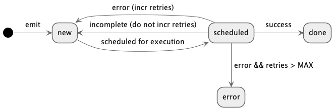
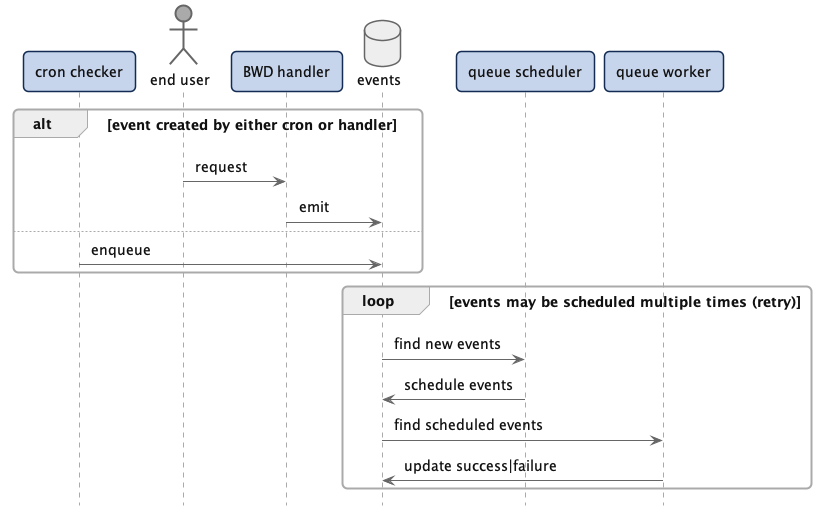

# Events

## What is an Event?

Events are generated any time a handler calls `emit` or automatically by a cron
handler on a set interval. They have a specific destination handler and a
lifecycle of processing. Events are stored mutably in Postgres, in the `events`
table, with each event being updated as it goes through the processing
pipeline. See the events schema for full details, but events importantly have
the following attributes:

- `status` is the current state of the event, beginning with `new`. See
  "**Event Lifecycle**" below.
- `canvas_id`, `name` together specificy the exact handler (`name`) on which
  canvas to execute when this event is processed.
- `value` is the emitted value (DObj) that was emitted by the handler
- `delay_until` is used to delay processing of an event until a specified time,
  frequently for error conditions.
- `retries` counts the number of times this event has been retried on error

## Event Lifecycle

An event's status is a FSM that begins in the `new` state. `new` events are
created either by a handler (HTTP or worker) calling `emit` or when the
`cron-checker` process determines that a cron handler's scheduled time has
elapsed.

Next, the `queue-scheduler` transitions the event to `scheduled` based on it's
scheduling priorities. The scheduler exists to ensure fair processing of
events, avoiding problems like head-of-line blocking that come from having a
single, global queue for all handlers across the platform. See "**Event
Scheduling**" for details.

The `queue-worker` processes actually execute the Dark code that is targeted by
each event. On completetion, the event transitions state, recording it's
`value` if successful. See the follow state diagram for a complete picture:

Here's a sequence diagram showing the various system components involved. Each
entity is run as a separate process (in a separate k8s pod, with a different
replica count).

## Event Scheduling

Event scheduling is currently very simple: every second, the scheduler
schedules any events that are 1) `new` and 2) are passed their `delay_until`
time.
