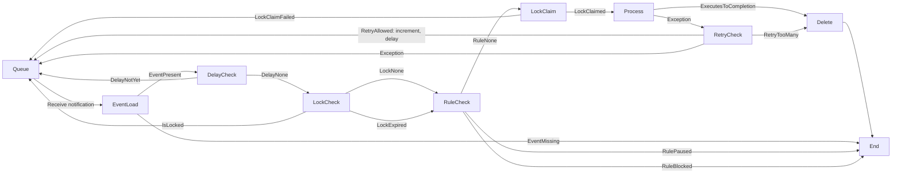

# Events V2 (updated May 8, 2022)

## Design of Events V2

Goals:

- do not do DB queries to find events to run (that is, move scheduling outside DB)
- support existing queue features (paused/blocked, retries, delays)
- do not run a scheduling service

## High level description

The Queue is made of 3 parts:

- `events table`: the backing store and source of truth for all events
- `QueueWorker`: workers that execute events
- `scheduler`: sends notifications to workers to run an Event (we use Google PubSub for this).

When an event is added, we save it in the events table, and add a message in PubSub.
The QueueWorkers pull messages from PubSub when they have capacity. They then fetch
the event from the EventsTable, and perform some logic to verify it should be run
(eg, is this handler paused, is something else running this events, etc). It may
decide to put the notification back into PubSub if it's not time to run it yet, or it
may decide that it should not be run and to drop the PubSub notification.

Why use PubSub? Because it is extremely operationally intensive to implement queue scheduling
in the DB.

Why not use PubSub for everything? Because it deletes messages after a week, and
doesn't have a `pause` option.

## What is an Event?

Events are generated any time a handler calls `emit` or automatically by a cron
handler on a set interval. They have a specific destination handler and a
lifecycle of processing. Events are stored mutably in Postgres, in the `eventsV2`
table. Completed events are deleted.

The scheduling of events is handled by a Pub/Sub subscription, which strictly only
handles the notification of the worker to try running an event. The presence of an
event in the subscription does not mean an event, since Pub/Sub does not handle
pausing.

### Scheduling related metadata

- `delayUntil` is used to delay processing of an event until a specified time
- `retries` counts the number of times this event has been retried on error
- `lockedAt` a worker will claim a lock before processing. DB locks are bad for this
  purpose since we're doing DB work at the same time. This "lock" is simply a timestamp to stake a claim.
- `enqueuedAt`: set when first enqueued

### Metadata

- `canvas_id`, `name` together specify the exact handler (`name`) on which
  canvas to execute when this event is processed.
- `value` is the emitted value (`DObj`) that was emitted to the handler

## DB schema

### Events

```
      Column       |            Type             |                      Modifiers
-------------------+-----------------------------+-----------------------
 id                | integer                     | not null default nextval ('events_id_seq'::regclass)
 canvas_id         | uuid                        | not null
 module            | text                        | not null
 name              | text                        | not null
 modifier          | text                        | not null
 value             | text                        | not null
 retries           | integer                     | not null default 0
 delay_until       | timestampz | not null default now()
 enqueued_at       | timestampz | not null default now()
 locked_at         | timestampz
```

### Scheduling rules

Code in `EventQueue.fs`. Allows a user to pause a queue, or allows an admin to lock a queue for operational purposes.

```
 id           | integer                     | not null default nextval('scheduling_rules_id_seq'::regclass)
 rule_type    | scheduling_rule_type        | not null
 canvas_id    | uuid                        | not null
 handler_name | text                        | not null
 event_space  | text                        | not null
 created_at   | timestamp without time zone | not null default now()
```

#### Scheduling_rules_type

```
enumlabel
----------------------
 pause
 block
```

## Emit

Done in `LibEvent` via `emit`, or automatically via `CronChecker`. Calls
`EventQueue2.enqueue`. This adds a new value to the events table with:

- `retries = 0`
- `locked_at = NULL`
- `delay_until = CURRENT_TIMESTAMP`
- `enqueued_at = CURRENT_TIMESTAMP`

Note that `CronChecker` does not use event table information to schedule, it uses
`cron_records`.

Emit also adds an event to the PubSub topic. This will be delivered to a worker to
tell it to try fetching and running an event. The PubSub worker has:

- `retries not set`
- `delay_until not set`

## Execution

`EventQueue2.dequeue` fetches a notification from PubSub and runs the process to
execute it. First it will check if it should run it, looking at retries, whether
another worker has set `locked_at` and holds the lock, whether scheduling rules tell
us not to run it, whether it's not time to run it yet, or if the event is missing.

In most cases it put the event back in PubSub (except for the situations where that
doesn't make sense). Because the event is just a notifcation, it's basically almost
always fine to put it back in so long as the record exists (which means it's done).


