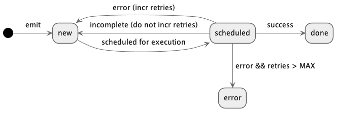

# Events (correct as of May 7, 2022)

## What is an Event?

Events are generated any time a handler calls `emit` or automatically by a cron
handler on a set interval. They have a specific destination handler and a
lifecycle of processing. Events are stored mutably in Postgres, in the `events`
table, with each event being updated as it goes through the processing
pipeline. See the events schema for full details, but events importantly have
the following attributes:

- `status` is the current state of the event, beginning with `new`. See
  "**Event Lifecycle**" below.
- `canvas_id`, `name` together specificy the exact handler (`name`) on which
  canvas to execute when this event is processed.
- `value` is the emitted value (`DObj`) that was emitted by the handler
- `delay_until` is used to delay processing of an event until a specified time,
  frequently for error conditions.
- `retries` counts the number of times this event has been retried on error

## DB schema

### Events

```
      Column       |            Type             |                      Modifiers
-------------------+-----------------------------+-----------------------
 id                | integer                     | not null default nextval ('events_id_seq'::regclass)
 status            | queue_status                | not null
 dequeued_by       | integer                     |
 canvas_id         | uuid                        | not null
 account_id        | uuid                        | not null
 space             | text                        | not null
 name              | text                        | not null
 value             | text                        | not null
 retries           | integer                     | not null default 0
 delay_until       | timestamp without time zone | not null default now()
 modifier          | text                        | not null
 enqueued_at       | timestamp with time zone    |
 last_processed_at | timestamp with time zone    |
```

#### queue_status

```
enumlabel
----------------------
 new # When first added or retried.
 scheduled # Ready to be picked up
 locked # Does not appear to be used
 done # Has succeeded
 error # Has failed (won't be retried)
 missing # canvas/handler couldn't be found (won't be retried)
```

### Scheduling rules

```
 id           | integer                     | not null default nextval('scheduling_rules_id_seq'::regclass)
 rule_type    | scheduling_rule_type        | not null
 canvas_id    | uuid                        | not null
 handler_name | text                        | not null
 event_space  | text                        | not null
 created_at   | timestamp without time zone | not null default now()
```

#### Scheduling_rules_type

```
enumlabel
----------------------
 pause
 block
```

## Emit

Done in `LibEvent` via `emit`, or automatically via `CronChecker`. Calls
`EventQueue.enqueue`. This adds a new value to the events table with:

- `status = 'new'`
- `dequeued_by = null`
- `delay_until = CURRENT_TIMESTAMP`
- `enqueued_at = CURRENT_TIMESTAMP`

Note that `CronChecker` does not use event table information to schedule, it uses
`cron_records`.

## Execution

Fetch the request with by calling `Event.dequeue`. Searches for `status=scheduled`.

When done, saved again with `status=done`.

## Error handling

Cases:

- we tried to load the canvas and couldn't
  - tracked in Telemetry with `event.load_success=false`
  - if `retries < 2`
    - increment `retries`
    - put back with `status=new`
  - else
    - put back with `status=error`
- error when running execute_handler
  - tracked in Telemetry with `event.execution_success=false`
  - same logic as loading the canvas
- Incomplete:
  - DOES NOT HAPPEN (removed at some point)
  - set `status=new`
  - set `delay_until` to 5 minutes from now.

## Scheduling rules

Code in `EventQueue.fs`. Allows a user to pause a queue, or allows an admin to lock a
queue for operational purposes.

## Scheduling

Code in `queue-scheduler/src/lib.rs`.

Every second, finds `status=new` with `delay_until` reached, so long as there's no
`block` or `pause` in this handler's `scheduling_rules`. Then it sets it to
`status=scheduled`, which the queueworker searches for.

## Event Lifecycle

An event's status is a FSM that begins in the `new` state. `new` events are
created either by a handler (HTTP or worker) calling `emit` or when the
`cron-checker` process determines that a cron handler's scheduled time has
elapsed.

Next, the `queue-scheduler` transitions the event to `scheduled` based on it's
scheduling priorities. The scheduler exists to ensure fair processing of
events, avoiding problems like head-of-line blocking that come from having a
single, global queue for all handlers across the platform. See "**Event
Scheduling**" for details.

The `queue-worker` processes actually execute the Dark code that is targeted by
each event. On completetion, the event transitions state, recording it's
`value` if successful. See the follow state diagram for a complete picture:



Here's a sequence diagram showing the various system components involved. Each
entity is run as a separate process (in a separate k8s pod, with a different
replica count).


