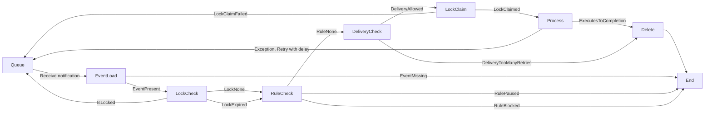

# Queues V2 (correct as of May 13, 2022)

## Design of Dark Queues V2

Goals:

- do not do DB queries to find events to run (that is, move scheduling outside DB)
- support existing queue features (paused/blocked, delayed retries)
- do not run a scheduling service

## Definitions

- `emit` adding an event to the queue from a Cron handler or the `emit` function
- `event`: refers to the Dark value `emit`ed into the queue and the metadata around
  it (including what you might call a "job" or "message" in other systems). We say we
  "run the event" when we execute it, or "retry the event" if we requeue it.
- `QueueWorker`: a queueworker is one of the machines which is running 1 or more
  events. Also the name of the module that implements it, as well as the kubernetes
  service, etc, around it.
- `queue`: encompasses everything else here
- `notification`: The source of truth for our eventing system in the `events_v2`
  table, so what exactly is being put into PubSub? We call this data a `notification`
  as it merely serves to notify us that there may be an event to execute (as opposed to
  PubSub being the source of truth for the queue)

## High level description

The queue implements the following features:

- events are added by calling `emit` or via CronChecker
- events are run in `WORKER` handlers on the canvas with the same name that the event
  was emitted to
- events are run asynchronously on separate worker machines
- worker handlers can be paused, meaning we won't start new events from that handler
- worker handlers can be blocked by Dark admins to prevent operational issues
- the UI shows the number of events in the queue
- at least once execution (events which experience issues after partial execution are retried)
- completed events are never retried (even if they complete with an error value,
  including `incomplete` or a type error)
- errors during execution cause events to be retried 5 minutes later (at most twice,
  after which they are dropped)

The queue also has the following accidental features:

- events do not have an execution time-limit

- events may be cancelled if the machine they are running on turns off. This should
  only happen to events that run longer than the shutdown grace period, currently 28
  seconds.

### Design of the queue

The Queue is made of 3 parts:

- `events_v2` table: the backing store and source of truth for all events
- `QueueWorker`: workers that execute events (also see Queue.fs)
- `Google PubSub` scheduler: sends notifications to workers to potentially run an Event

New definitions:

- `notification`: a message containing an event ID, used to tell a queueworker which
  event to fetch
- `PubSub subscription`: what we read notifications from. Technically, we emit
  notifications to a `PubSub Topic`, but the distinction isn't important.

**Important**: The scheduling of events is handled by a Pub/Sub subscription, which
**only** handles notifying the worker to try running an event. The worker may know
that it should not run it, for example if the worker is paused. The presence of a
notification in the PubSub subscription does not mean an actual event will be run.
Also, an event in the DB does not imply exactly one notification in PubSub - there
may be more than one (if the user pressed pause/unpause a bit), or none (if a handler
is currently paused).

When an event is first `emit`ted, we save it in the `events_v2` table, and add a
**Notification** in PubSub. The QueueWorkers pull messages from PubSub when they
have capacity. They then fetch the event from the `events_v2`, and perform some logic
to verify it should be run (eg, is this handler paused, is something else already
running this events, etc), possibly updating the stored event. It may decide to put
the notification back into PubSub if it's not time to run it yet, or it may decide
that it should not be run and to drop the PubSub notification. Completed events are
deleted.

### Design decisions

Why use PubSub?

- we spent over 50% of our DB managing worker scheduling

Why not use PubSub for everything?

- PubSub deletes messages after a week, so we'd have to implement extra (and difficult) logic to handle pausing
- Similarly, emiting events in the far future would be harder to implement
- PubSub does not support pausing
- Queues can be paused and unpaused in quick succession by the user, meaning that
  there can be multiple PubSub items for the same event in the queue.
- PubSub cannot be used to count the length of the queue, and that's a really cool feature

## DB schema

### Events

The `events_v2` table has event data

- `canvas_id`, `module`, `name`, `modifier` together specify the exact handler on
  which canvas to execute when this event is processed.
- `value` is the emitted value (`DDict`) that was emitted to the handler

It also holds scheduling metadata for an event:

- `id` an id for the event. Not the same a PubSub id.
- `lockedAt` a worker will claim a lock before processing. DB locks are bad for this
  purpose since we're doing DB work at the same time. This "lock" is simply a timestamp
  to stake a claim.
- `enqueuedAt`: set when first enqueued

```
      Column       |            Type             |                      Modifiers
-------------------+-----------------------------+-----------------------
 id                | uuid                        | not null default nextval ('events_id_seq'::regclass)
 canvas_id         | uuid                        | not null
 module            | text                        | not null
 name              | text                        | not null
 modifier          | text                        | not null
 value             | text                        | not null
 enqueued_at       | timestampz | not null default now()
 locked_at         | timestampz
```

#### Scheduling rules

Code in `EventQueue.fs`. Allows a user to pause a queue, or allows an admin to lock a queue for operational purposes.

```
 id           | integer                     | not null default nextval('scheduling_rules_id_seq'::regclass)
 rule_type    | scheduling_rule_type        | not null
 canvas_id    | uuid                        | not null
 handler_name | text                        | not null
 event_space  | text                        | not null # the space/module of the handler
 created_at   | timestamp without time zone | not null default now()
```

`scheduling_rules_type` values can be `pause` or `block`.

## How features are implemented

### Basic operation

`emit` saved the event in the DB, and sends a notification to PubSub. QueueWorkers
fetch notifications from PubSub, load the event, execute it, then delete the Event
from PubSub and the DB.

### Pausing/Unpausing

When the notification is delivered from PubSub to a QueueWorker, the QueueWorker
checks the scheduling rules for the handler. If it is blocked by an admin or paused
by the user, the PubSub notification is dropped, but the event remains in the DB.
When the handler is unpaused, notifications are added to PubSub to schedule them.

If the user pauses and unpauses in quick succession, there could be multiple
notifications in PubSub for the same event. To handle this, there is per-event
locking using the `lockedAt` column.

### Errors

If a handler completes, then the Event is completed regardless of whether the outcome
is an error.

If there is an execution error, the QueueWorker will immediately tell PubSub to retry
in 5 minutes.

If there was an operational error, the QueueWorker will not be able to do anything to
the event. However, the QueueWorker will not acknowledge the PubSub notification, and
so when the PubSub acknowledgement deadline for that notification passes, PubSub will
attempt to deliver it again. PubSub is configured to try a message 5 times, then it
publishes it in a deadletter queue. We do not currently have any automation on the
deadletter queue.

An event that has more than 5 delays will be deleted by the QueueWorker.

"Bad" notifications (perhaps they can't be read by the queueworker) will be discarded
by PubSub after a week.

### Queue counts

We do a DB query for the number of events for that canvas/handler.

### Emit

Done in `LibEvent` via `emit`, or automatically via `CronChecker`. Calls
`Queue.enqueue`. This adds a new value to the events table with:

- `locked_at = NULL`
- `enqueued_at = CURRENT_TIMESTAMP`

Note that `CronChecker` does not use `events_v2` table information for Cron
scheduling (eg determining if it has been an hour since the last Cron event). That is
tracked in the `cron_records_v0` table, `CronChecker` just emits events on the
appropriate schedule, leaving it to the queues to handle after that.

`emit` also adds a notification to the PubSub topic. This will be delivered to a
QueueWorker to tell it to try fetching and running an event. After 5 retries, PubSub
will drop the notification, sending it to a dead-letter queue (which at the moment
has no UI or anything).

### QueueWorker Execution

`QueueWorker.dequeueAndProcess` fetches a notification from PubSub and runs the
process to execute it. First it will check if it should run it, looking at retries,
whether another worker has set `locked_at` and holds the lock, whether scheduling
rules tell us not to run it, whether it's not time to run it yet, or if the event is
missing.

Notifications have a built-in _ack deadline_ - they must be _acknowledged_ within a
changeable time limit. The default is 60 seconds. If a queueworker decides not to run
an event immediately, it will put back the notification by setting the ack deadline
to a more appropriate time. If it decides it should not be run (eg if paused) it will
remove it from PubSub by _acknowledging_ it.

If a QueueWorker decides to runs the event, it will increase the _ack time_ to 5
minutes to give it time to execute. When it is done, it removes it from the queue by
_acknowledging_ it.

Because the event is just a notification, it's basically almost always fine to put it
back in so long as the DB row for the event exists (which means it's done). However,
PubSub will only try to deliver it 5 times.

Note that normally, only one notification exists for an event. The exception is when
workers are pause or unpaused.


